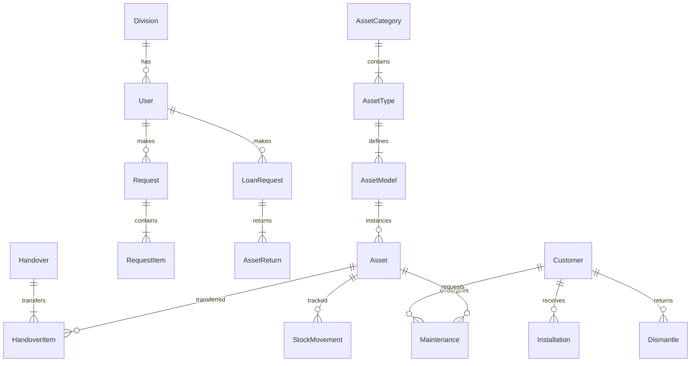

# Dokumentasi Skema Database (Physical Data Model)

Dokumen ini menjelaskan struktur fisik database yang diimplementasikan menggunakan **PostgreSQL** dan **Prisma ORM**. Skema ini dirancang untuk mengakomodir seluruh fitur aplikasi Trinity AssetFlow.

> **Last Updated**: January 2026  
> **Schema Version**: 1.2.0

## 1. Ringkasan ERD (Entity Relationship Diagram)



## 2. Enums (Status & Types)

### 2.1. User Roles

```prisma
enum UserRole {
  SUPER_ADMIN     // Full system access
  ADMIN_LOGISTIK  // Logistics management
  ADMIN_PURCHASE  // Procurement management
  LEADER          // Team leader with approval rights
  STAFF           // Regular staff
  TEKNISI         // Field technician
}
```

### 2.2. Asset Status

```prisma
enum AssetStatus {
  IN_STORAGE       // Available in warehouse
  IN_USE           // Deployed/in use
  ON_LOAN          // Temporarily loaned
  IN_CUSTODY       // Held by staff (custody)
  UNDER_REPAIR     // Being repaired internally
  OUT_FOR_SERVICE  // Sent out for external service
  DAMAGED          // Damaged, needs assessment
  AWAITING_RETURN  // Pending return from loan/customer
  CONSUMED         // Fully consumed (for measurement items)
  DISPOSED         // Written off/disposed
}
```

### 2.3. Asset Condition

```prisma
enum AssetCondition {
  BRAND_NEW     // Factory new
  GOOD          // Working perfectly
  USED_OKAY     // Used but still functional
  MINOR_DAMAGE  // Minor issues, still usable
  MAJOR_DAMAGE  // Significant issues
  BROKEN        // Not functional
  FOR_PARTS     // Only usable for spare parts
}
```

### 2.4. Request & Loan Status

```prisma
enum RequestStatus {
  PENDING, LOGISTIC_APPROVED, LOGISTIC_REJECTED,
  PURCHASE_APPROVED, PURCHASE_REJECTED, ORDERED,
  ARRIVED, AWAITING_HANDOVER, COMPLETED, REJECTED
}

enum LoanStatus {
  PENDING, APPROVED, REJECTED, ON_LOAN, RETURNED
}

enum AssetReturnStatus {
  PENDING, APPROVED, REJECTED
}
```

## 3. Definisi Model (Prisma Schema)

### 3.1. User Management

```prisma
model Division {
  id    Int    @id @default(autoincrement())
  name  String @unique
  users User[]
}

model User {
  id          Int      @id @default(autoincrement())
  email       String   @unique
  password    String   // bcrypt hashed
  name        String
  role        UserRole @default(STAFF)
  divisionId  Int?
  division    Division? @relation(fields: [divisionId], references: [id])

  permissions String[] @default([])
  passwordResetRequested Boolean @default(false)
  passwordResetRequestDate DateTime?

  requests    Request[]
  loanRequests LoanRequest[]

  createdAt   DateTime @default(now())
  updatedAt   DateTime @updatedAt
  deletedAt   DateTime?
}
```

### 3.2. Asset Management (Master Data)

```prisma
model AssetCategory {
  id                    Int     @id @default(autoincrement())
  name                  String  @unique
  isCustomerInstallable Boolean @default(false)
  types                 AssetType[]
  associatedDivisions   Int[]   @default([])
}

model AssetType {
  id              Int           @id @default(autoincrement())
  categoryId      Int
  category        AssetCategory @relation(fields: [categoryId], references: [id])
  name            String        // e.g., "Router", "Kabel"
  classification  String        // 'asset' (satuan) or 'material' (bulk)
  trackingMethod  String        // 'individual' or 'bulk'
  unitOfMeasure   String        // 'Unit', 'Meter'
  models          AssetModel[]
}

model AssetModel {
  id                Int       @id @default(autoincrement())
  typeId            Int
  type              AssetType @relation(fields: [typeId], references: [id])
  name              String    // e.g. "Dropcore 1 Core"
  brand             String    // e.g. "Fiberhome"

  // Bulk Configuration
  bulkType          String?   // 'count' or 'measurement'
  unitOfMeasure     String?   // 'Hasbal', 'Box' (Fisik)
  baseUnitOfMeasure String?   // 'Meter' (Isi)
  quantityPerUnit   Float?    // e.g. 1000 (1 Hasbal = 1000 Meter)

  assets            Asset[]
}
```

### 2.3. Asset Inventory (Instances)

```prisma
model Asset {
  id              String      @id // Custom ID: "AST-2025-001"
  name            String
  brand           String

  modelId         Int?
  model           AssetModel? @relation(fields: [modelId], references: [id])

  serialNumber    String?     // Unique for individual assets
  macAddress      String?

  // Status & Condition
  status          String      // 'IN_STORAGE', 'IN_USE', 'DAMAGED'
  condition       String      // 'GOOD', 'MINOR_DAMAGE'

  // Measurement / Bulk Tracking
  initialBalance  Float?      // Kapasitas awal (e.g. 1000 Meter)
  currentBalance  Float?      // Sisa stok (e.g. 850 Meter)
  quantity        Int?        // Untuk item 'Count' sederhana (e.g. 50 Pcs)

  // Location / Assignment
  location        String?     // "Gudang A", "Rak 1"
  locationDetail  String?
  currentUser     String?     // Bisa ID User atau ID Customer

  // Financial
  purchasePrice   Decimal?
  purchaseDate    DateTime?
  vendor          String?
  poNumber        String?
  invoiceNumber   String?
  warrantyEndDate DateTime?

  // History & Docs
  woRoIntNumber   String?     // Referensi dokumen asal (RO/HO)
  isDismantled    Boolean     @default(false)

  createdAt       DateTime    @default(now())
  updatedAt       DateTime    @updatedAt
  deletedAt       DateTime?
}
```

### 2.4. Request & Procurement

```prisma
model Request {
  id              String        @id // "RO-..."
  requesterId     Int
  requester       User          @relation(fields: [requesterId], references: [id])
  division        String
  status          String
  requestDate     DateTime

  // Order Details
  orderType       String        // 'Regular Stock', 'Urgent', 'Project Based'
  justification   String?
  project         String?
  allocationTarget String?      // 'Usage', 'Inventory'

  items           RequestItem[]

  // Approval
  logisticApprover String?
  finalApprover    String?

  // Procurement
  totalValue       Decimal?
  purchaseDetails  Json?        // Stores pricing info per item
}

model RequestItem {
  id              Int     @id @default(autoincrement())
  requestId       String
  request         Request @relation(fields: [requestId], references: [id])

  itemName        String
  itemTypeBrand   String
  quantity        Int
  unit            String?

  // Approval Status
  status          String? // 'approved', 'rejected', 'stock_allocated'
  approvedQty     Int?
  reason          String?
}
```

### 2.5. Transactions (Operational)

```prisma
model Handover {
  id            String   @id // "HO-..."
  docNumber     String   @unique
  handoverDate  DateTime
  menyerahkan   String
  penerima      String
  status        String
  items         Json     // Snapshot item serah terima
}

model LoanRequest {
  id              String   @id // "RL-..."
  requester       String
  status          String
  items           Json
  assignedAssets  Json?    // Map ItemID -> [AssetID]
  returnedAssets  String[] // Array of AssetIDs returned
}

model Installation {
  id              String   @id // "INST-..."
  docNumber       String   @unique
  customerId      String
  technician      String
  assetsInstalled Json     // Array of { assetId, name, sn }
  materialsUsed   Json     // Array of { itemName, qty, ... }
}
```

## 3. Catatan Penting

1.  **JSONB untuk Transaksi**: Tabel `Handover`, `LoanRequest`, dan `Installation` menggunakan tipe data `JSONB` untuk menyimpan detail item. Ini memberikan fleksibilitas dan performa tinggi tanpa perlu membuat tabel relasi _join_ yang terlalu banyak untuk data historis yang bersifat statis (snapshot).
2.  **Tracking Stok**:
    - **Individual**: Gunakan tabel `Asset` dengan `id` unik per unit.
    - **Measurement**: Gunakan tabel `Asset` dengan `id` unik per batch/drum, dan kurangi `currentBalance` saat ada pemakaian.
    - **Count**: Bisa menggunakan `Asset` dengan `quantity` > 1, atau _single row_ per item fisik.
